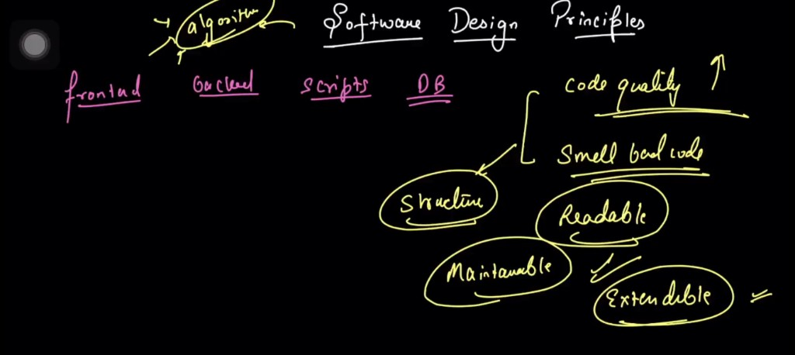
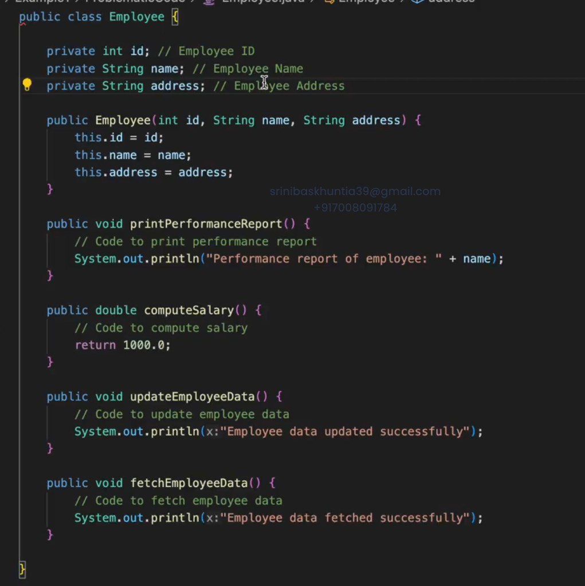
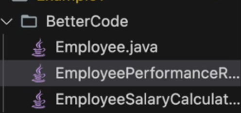
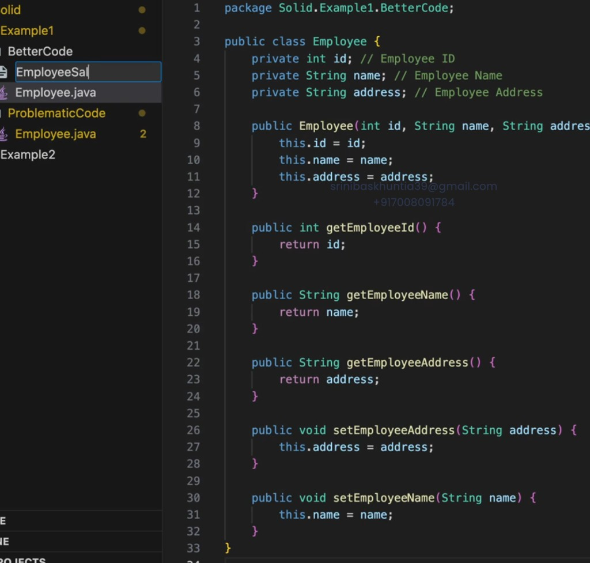
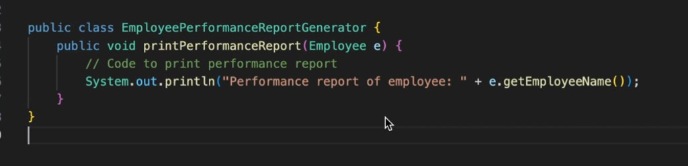
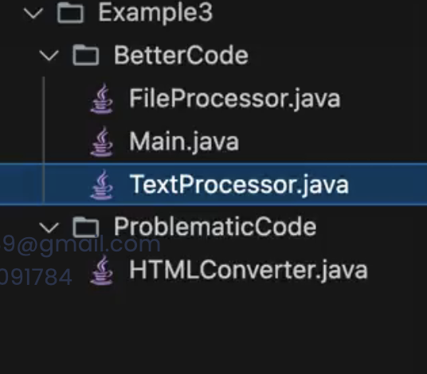
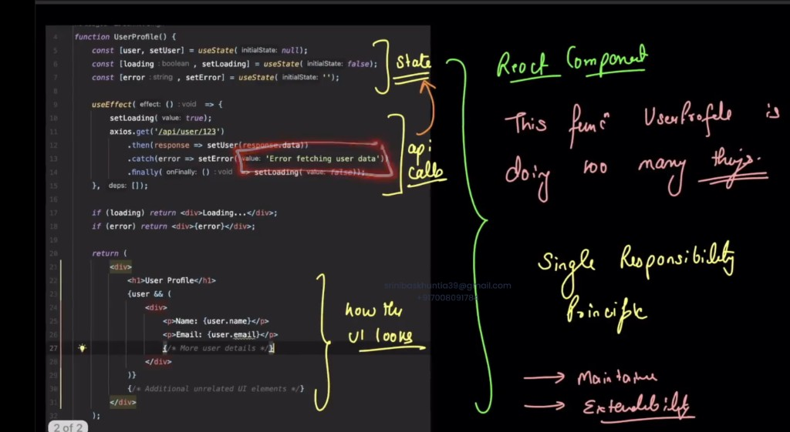
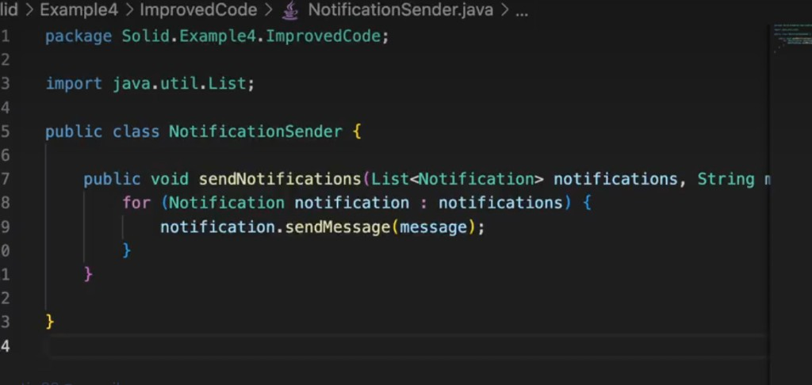

# SRP , OCP,  LSP , Strategy Pattern



# Problematic code



 - We are doing too many things in the single class.This is a violation of SRP.

 - SRP states that there should be only one reason to change a class.

# Better code (SRP applied)

Split responsibilities into separate classes so each has only one reason to change.

## Project structure



- `Employee.java` — employee data only
- `EmployeePerformanceReportGenerator.java` — performance reporting
- `EmployeeSalaryCalculator.java` — salary calculation

## Employee entity

`Employee` is now a simple POJO with data and getters/setters only.



## Performance report

Reporting logic lives in its own class.



## Example 3: HTML converter

HTML converter which converts plain text into HTML.

### Project structure



- **ProblematicCode** — `HTMLConverter.java` (single class doing too much)
- **BetterCode** — `FileProcessor.java`, `TextProcessor.java`, `Main.java`

File processor deals with file operations like reading and writing.
Text processor deals with text processing like converting text to HTML.
Main class is the entry point of the application.

In frontend also, SRP can be applied.

## Example 4: React `UserProfile` (frontend)

`UserProfile` mixes state, API calls, and UI in one component — a violation of SRP.



- **State** — `useState` for user, loading, error
- **API call** — `useEffect` + `axios` to fetch data
- **UI** — JSX for loading, error, and profile display

One function should not own all three; each should have a single reason to change.

### Solution: separate data logic from UI

**1. Custom hook — data fetching and state (`useUser.js`)**

```javascript
function useUser(userId) {
  const [user, setUser] = useState(null);
  const [loading, setLoading] = useState(false);
  const [error, setError] = useState('');

  useEffect(() => {
    setLoading(true);
    axios.get(`/api/user/${userId}`)
      .then(response => setUser(response.data))
      .catch(() => setError('Error fetching user data'))
      .finally(() => setLoading(false));
  }, [userId]);

  return { user, loading, error };
}
```

**2. Component — UI only (`UserProfile.js`)**

```javascript
function UserProfile({ userId }) {
  const { user, loading, error } = useUser(userId);

  if (loading) return <div>Loading...</div>;
  if (error) return <div>{error}</div>;
  if (!user) return null;

  return (
    <div>
      <h1>User Profile</h1>
      <div>
        <p>Name: {user.name}</p>
        <p>Email: {user.email}</p>
      </div>
    </div>
  );
}
```

| Responsibility | Before | After |
|----------------|--------|-------|
| Fetch user data | `UserProfile` | `useUser` hook |
| Render UI | `UserProfile` | `UserProfile` |

This improves **maintainability** (change API without touching UI) and **extensibility** (reuse `useUser` in other components).

# OCP — Open for extension, closed for modification

Software entities should be **open for extension** (add new behavior) but **closed for modification** (avoid changing existing, tested code).

## Example: Notification system

### Problematic code

`NotificationSender` checks the type of each notification and calls different logic. Every new channel (Push, WhatsApp, etc.) forces you to **edit this class**.

```java
package Solid.Example4.ProblematicCode;

import java.util.List;

public class NotificationSender {

    public void sendNotifications(List<Object> notifications, String message) {
        for (Object notification : notifications) {
            if (notification instanceof EmailNotification) {
                ((EmailNotification) notification).sendEmail(message);
            } else if (notification instanceof SMSNotification) {
                ((SMSNotification) notification).sendSMS(message);
            }
            // Adding PushNotification? Modify this class again — violates OCP
        }
    }
}
```

- **Open for extension?** No — new types need changes inside `NotificationSender`.
- **Closed for modification?** No — the sender keeps growing with `if-else` / `switch`.

### Solution (OCP applied)

Introduce a `Notification` abstraction. Add new notification types by **creating new classes**, not by changing `NotificationSender`.

**1. Contract**

```java
package Solid.Example4.ImprovedCode;

public interface Notification {
    void sendMessage(String message);
}
```

**2. Concrete implementations**

```java
public class EmailNotification implements Notification {
    @Override
    public void sendMessage(String message) {
        System.out.println("Sending email: " + message);
    }
}

public class SMSNotification implements Notification {
    @Override
    public void sendMessage(String message) {
        System.out.println("Sending SMS: " + message);
    }
}
```

**3. Sender — closed for modification**



```java
package Solid.Example4.ImprovedCode;

import java.util.List;

public class NotificationSender {

    public void sendNotifications(List<Notification> notifications, String message) {
        for (Notification notification : notifications) {
            notification.sendMessage(message);
        }
    }
}
```

To add `PushNotification`, create a new class that implements `Notification`. **`NotificationSender` stays unchanged.**

| | Problematic | Improved (OCP) |
|--|-------------|----------------|
| Add new notification type | Edit `NotificationSender` | Add new `Notification` implementation |
| Sender depends on | Concrete types (`instanceof`) | Abstraction (`Notification`) |
| OCP | Violated | Satisfied |


Liskov Substitution Principle - Objects of child class is AS-IS substituble by variables by parent class.

Don't do forceful implementation of a behaviour.  if some function has a behaviour, 
create a new abstract class / interface .

### Example: Credit card payment system

#### Project structure


**ProblematicCode** — every card extends one `CreditCard` with all methods (forced behaviour).

**BetterCode** — base `CreditCard` plus capability interfaces (`RefundCompatibleCreditCard`, `UpiCompatibleCreditCard`); each card implements only what it supports.

#### Problematic code

All cards inherit `refund()` and `upiPay()` from `CreditCard`. Cards that do not support a feature throw exceptions or stub empty logic — **child cannot safely replace parent** (LSP violation).

```java
package Solid.Example5.ProblematicCode;

public abstract class CreditCard {
    public abstract void pay(double amount);
    public abstract void refund(double amount);  // not all cards support this
    public abstract void upiPay(double amount);  // not all cards support this
}

public class RupayCreditCard extends CreditCard {
    @Override
    public void pay(double amount) {
        System.out.println("Paid " + amount + " via RuPay");
    }

    @Override
    public void refund(double amount) {
        throw new UnsupportedOperationException("RuPay does not support refund");
    }

    @Override
    public void upiPay(double amount) {
        System.out.println("UPI pay " + amount + " via RuPay");
    }
}

public class AmexCreditCard extends CreditCard {
    @Override
    public void pay(double amount) { /* ... */ }

    @Override
    public void refund(double amount) { /* refund logic */ }

    @Override
    public void upiPay(double amount) {
        throw new UnsupportedOperationException("Amex does not support UPI");
    }
}
```

- Caller expects any `CreditCard` to support `refund()` / `upiPay()` — substituting `RupayCreditCard` or `AmexCreditCard` breaks that expectation.
- Forced methods on the base class are a design smell.

#### Solution (LSP applied)

Split optional behaviours into **separate interfaces**. A card implements only the contracts it actually supports.

```java
package Solid.Example5.BetterCode;

public interface CreditCard {
    void pay(double amount);
}

public interface RefundCompatibleCreditCard extends CreditCard {
    void refund(double amount);
}

public interface UpiCompatibleCreditCard extends CreditCard {
    void upiPay(double amount);
}
```

**Concrete cards — no forced stubs or exceptions**

```java
public class RupayCreditCard implements UpiCompatibleCreditCard {
    @Override
    public void pay(double amount) {
        System.out.println("Paid " + amount + " via RuPay");
    }

    @Override
    public void upiPay(double amount) {
        System.out.println("UPI pay " + amount + " via RuPay");
    }
}

public class AmexCreditCard implements RefundCompatibleCreditCard {
    @Override
    public void pay(double amount) { /* ... */ }

    @Override
    public void refund(double amount) { /* refund logic */ }
}

public class VisaCreditCard implements CreditCard, RefundCompatibleCreditCard, UpiCompatibleCreditCard {
    // implements pay, refund, and upiPay — all supported
}
```

**Usage**

```java
void processPayment(CreditCard card, double amount) {
    card.pay(amount);  // any CreditCard works
}

void processRefund(RefundCompatibleCreditCard card, double amount) {
    card.refund(amount);  // only cards that truly support refund
}

void processUpi(UpiCompatibleCreditCard card, double amount) {
    card.upiPay(amount);  // only cards that truly support UPI
}
```

| | Problematic | Better (LSP) |
|--|-------------|--------------|
| Base type promises | `pay`, `refund`, `upiPay` for all | `pay` only on `CreditCard` |
| Optional features | Forced on every subclass | Separate capability interfaces |
| Substitutability | Child may throw at runtime | Child always honours its contract |

Add `DinersCreditCard`, `MasterCreditCard`, etc. by implementing the interfaces they actually support — no changes to unrelated cards.

- Now one more problem what if refund is same for some cards , then we would do code 
duplication . Here we can use <b>Strategy Pattern</b> to avoid code duplication.

## Strategy Pattern

Used to define a family of algorithms, encapsulate each one, and make them interchangeable. Strategy lets the algorithm vary independently from clients that use it (e.g. searching, sorting, **refund logic**).

### Example: `RefundStrategy` (Strategy A & Strategy B)

When multiple cards share the same refund behaviour, extract refund into a strategy instead of duplicating code in each card class.

**1. Strategy interface**

```java
public interface RefundStrategy {
    void refund(double amount);
}
```

**2. Two strategies — A and B**

```java
public class RefundStrategyA implements RefundStrategy {
    @Override
    public void refund(double amount) {
        System.out.println("Strategy A: instant refund of " + amount);
    }
}

public class RefundStrategyB implements RefundStrategy {
    @Override
    public void refund(double amount) {
        System.out.println("Strategy B: refund after 3 business days for " + amount);
    }
}
```

**3. Context — uses a strategy at runtime**

```java
public class RefundProcessor {
    private RefundStrategy refundStrategy;

    public RefundProcessor(RefundStrategy refundStrategy) {
        this.refundStrategy = refundStrategy;
    }

    public void setRefundStrategy(RefundStrategy refundStrategy) {
        this.refundStrategy = refundStrategy;
    }

    public void processRefund(double amount) {
        refundStrategy.refund(amount);
    }
}
```

**4. Usage — swap strategy without changing client code**

```java
RefundProcessor processor = new RefundProcessor(new RefundStrategyA());
processor.processRefund(500.0);  // instant refund

processor.setRefundStrategy(new RefundStrategyB());
processor.processRefund(500.0);  // delayed refund
```

**Cards reuse the same strategy (no duplication)**

```java
public class AmexCreditCard implements RefundCompatibleCreditCard {
    private final RefundStrategy refundStrategy = new RefundStrategyA();

    @Override
    public void refund(double amount) {
        refundStrategy.refund(amount);
    }
    // pay() ...
}

public class DinersCreditCard implements RefundCompatibleCreditCard {
    private final RefundStrategy refundStrategy = new RefundStrategyA();  // same logic as Amex

    @Override
    public void refund(double amount) {
        refundStrategy.refund(amount);
    }
    // pay() ...
}
```

| Role | Class |
|------|-------|
| Strategy interface | `RefundStrategy` |
| Concrete strategies | `RefundStrategyA`, `RefundStrategyB` |
| Context | `RefundProcessor` (or card delegating to strategy) |

New refund behaviour? Add `RefundStrategyC` — no need to change existing card classes.
