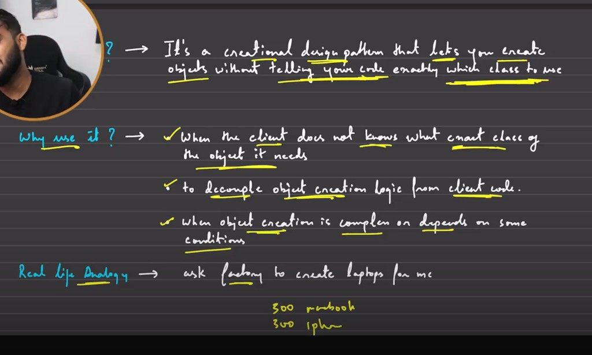
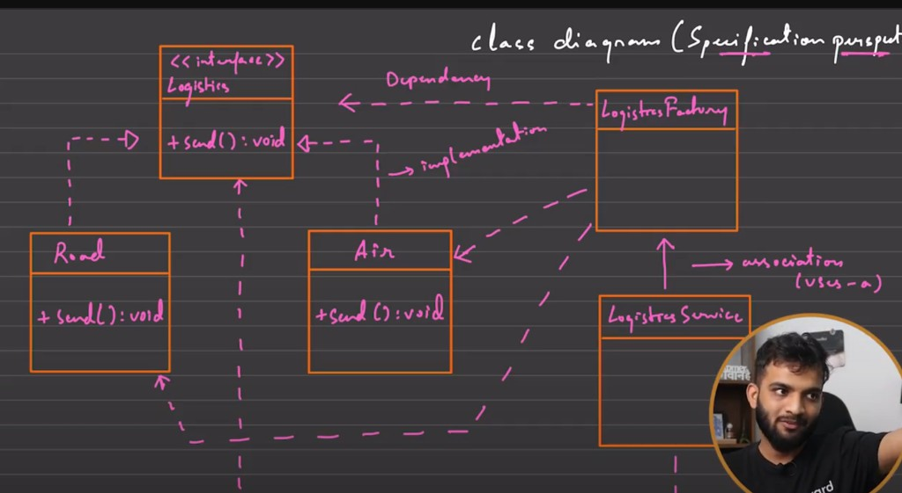

# Factory Pattern

## 1. Why this pattern? What problem does it solve?

Factory is a creational pattern that creates objects **without forcing client code to directly use concrete classes**.

In plain words: client asks for a capability, factory decides which concrete object to return.



**Use it when:**

- Client should depend on an interface, not specific implementations.
- Object creation has conditions (`mode`, config, feature flags, region, etc.).
- You want to keep creation logic in one place (SRP-friendly).
- New variants should be added with minimal client changes (supports OCP directionally).

---

## 2. The problem without Factory (tight coupling)

If client code does this:

```java
if (mode.equals("Air")) {
    logistics = new Air();
} else if (mode.equals("Road")) {
    logistics = new Road();
} else if (mode.equals("Train")) {
    logistics = new Train();
}
```

then every new transport mode forces edits in client/service code.  
That spreads creation logic across the codebase and increases bug risk.

---

## 3. Real-life analogy

You say to a logistics counter: “Ship this parcel to city X quickly.”  
You do **not** decide whether truck, flight, or train is picked. The system/factory picks based on rules.

---

## 4. Step-by-step implementation

### 4.1 Product interface

```java
interface Logistics {
    void send();
}
```

### 4.2 Concrete products

```java
class Road implements Logistics {
    @Override
    public void send() {
        System.out.println("Sending by road");
    }
}

class Air implements Logistics {
    @Override
    public void send() {
        System.out.println("Sending by air");
    }
}

class Train implements Logistics {
    @Override
    public void send() {
        System.out.println("Sending by train");
    }
}
```

### 4.3 Factory

```java
final class LogisticsFactory {
    private LogisticsFactory() {}

    public static Logistics getLogistics(String mode) {
        if (mode == null) {
            throw new IllegalArgumentException("mode cannot be null");
        }

        return switch (mode.trim().toLowerCase()) {
            case "road" -> new Road();
            case "air" -> new Air();
            case "train" -> new Train();
            default -> throw new IllegalArgumentException("Unsupported mode: " + mode);
        };
    }
}
```

### 4.4 Client/service uses factory (no `new Road()` etc. here)

```java
class LogisticsService {
    public void dispatch(String mode) {
        Logistics logistics = LogisticsFactory.getLogistics(mode);
        logistics.send();
    }
}

public class Main {
    public static void main(String[] args) {
        LogisticsService service = new LogisticsService();
        service.dispatch("road");
        service.dispatch("air");
        service.dispatch("train");
    }
}
```

---

## 5. Why this is better

- `LogisticsService` now depends on `Logistics` abstraction, not concrete classes.
- Creation rules are centralized in `LogisticsFactory`.
- Safer to evolve: one place to validate/normalize mode strings.
- Easier to test client behavior by mocking/stubbing `Logistics`.

---

## 6. Pros and cons

| Pros | Cons |
|------|------|
| Reduces coupling between client and concrete classes | Adds extra classes/indirection |
| Centralizes object creation logic (SRP) | Can become a large `if/switch` if not refactored |
| Improves maintainability and readability | Slightly more boilerplate for small apps |
| Makes extension cleaner than scattered `new` calls | Incorrect factory design can become a bottleneck |
| Helps keep creation policy consistent | |

---

## 7. Class diagram (visual)



---

## 8. Optional improvement: avoid large switch

If modes grow a lot, replace `switch` with a registry map:

```java
import java.util.Map;
import java.util.function.Supplier;

final class LogisticsFactory {
    private static final Map<String, Supplier<Logistics>> REGISTRY = Map.of(
        "road", Road::new,
        "air", Air::new,
        "train", Train::new
    );

    private LogisticsFactory() {}

    public static Logistics getLogistics(String mode) {
        Supplier<Logistics> supplier = REGISTRY.get(mode == null ? "" : mode.trim().toLowerCase());
        if (supplier == null) {
            throw new IllegalArgumentException("Unsupported mode: " + mode);
        }
        return supplier.get();
    }
}
```

This keeps the factory cleaner as variants grow.

---

## 9. Quick self-check

- [ ] Why is direct `new Air()/new Road()` in service code a coupling problem?
- [ ] Which class should know creation rules: client or factory?
- [ ] How would you add `Ship` mode with minimum safe changes?
- [ ] When is simple factory enough vs needing Factory Method pattern?

---

## 10. Simple practice implementation (do this now)

Build a tiny **Notification Factory**.

### Problem statement

Your app can send notifications using:

- `Email`
- `SMS`
- `Push`

Client code should call only one factory method and should not do `new EmailSender()` directly.

### Step A: Starter code (copy this)

```java
interface NotificationSender {
    void send(String message);
}

class EmailSender implements NotificationSender {
    @Override
    public void send(String message) {
        System.out.println("EMAIL: " + message);
    }
}

class SmsSender implements NotificationSender {
    @Override
    public void send(String message) {
        System.out.println("SMS: " + message);
    }
}

class PushSender implements NotificationSender {
    @Override
    public void send(String message) {
        System.out.println("PUSH: " + message);
    }
}

final class NotificationFactory {
    private NotificationFactory() {}

    public static NotificationSender getSender(String channel) {
        // TODO: implement using switch on channel (email/sms/push)
        // throw IllegalArgumentException for invalid channel
        return null;
    }
}

public class Main {
    public static void main(String[] args) {
        NotificationSender s1 = NotificationFactory.getSender("email");
        NotificationSender s2 = NotificationFactory.getSender("sms");
        NotificationSender s3 = NotificationFactory.getSender("push");

        s1.send("Welcome!");
        s2.send("OTP is 123456");
        s3.send("You have a new follower");
    }
}
```

### Step B: Your TODO

- Implement `NotificationFactory.getSender(...)`.
- Normalize input using `trim().toLowerCase()`.
- Throw clear error for unsupported values.

### Step C: Expected output

```text
EMAIL: Welcome!
SMS: OTP is 123456
PUSH: You have a new follower
```

<details>
<summary>Show solution</summary>

```java
public static NotificationSender getSender(String channel) {
    if (channel == null) {
        throw new IllegalArgumentException("channel cannot be null");
    }

    return switch (channel.trim().toLowerCase()) {
        case "email" -> new EmailSender();
        case "sms" -> new SmsSender();
        case "push" -> new PushSender();
        default -> throw new IllegalArgumentException("Unsupported channel: " + channel);
    };
}
```

</details>