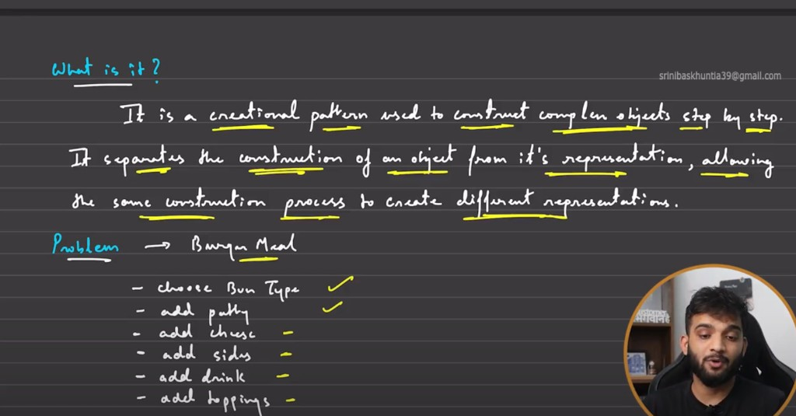
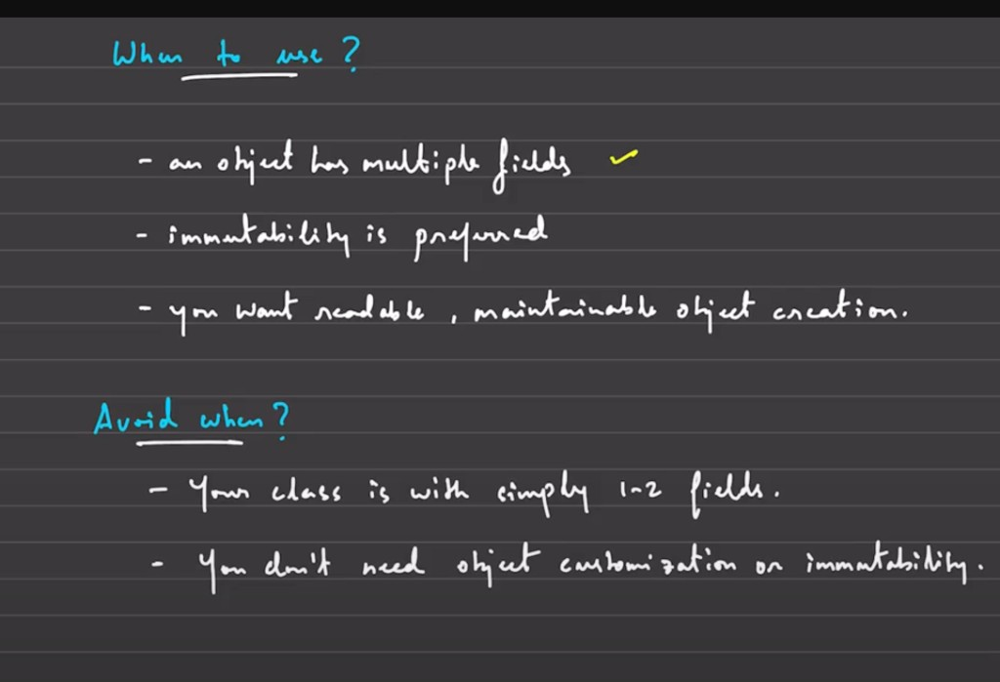
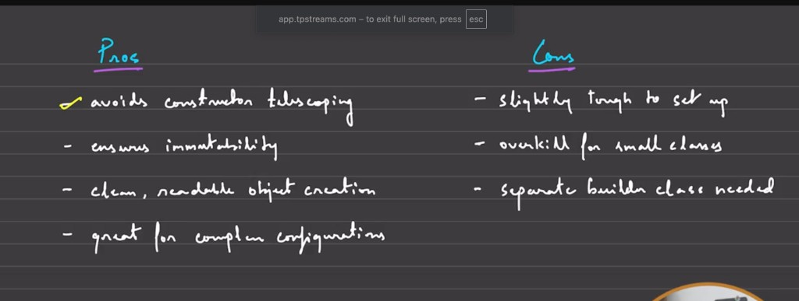

# Builder Pattern

## 1. What is it? What problem does it solve?

Builder is a creational pattern used to construct complex objects step-by-step.  
It separates **object construction** from **object representation**, so the same process can create different variants cleanly.



---

## 2. Problem without Builder (telescoping constructor)

Suppose we have `BurgerMeal`:

- Required: `bunType`, `patty`
- Optional: `hasCheese`, `toppings`, `side`, `drink`

Without Builder, constructor calls become hard to read and easy to break:

```java
BurgerMeal meal = new BurgerMeal("wheat", "veg", false, null, null, null);
```

If tomorrow a new parameter is added/removed/reordered, many call sites must change.

---

## 3. Builder implementation (Java)

```java
import java.util.ArrayList;
import java.util.List;

class BurgerMeal {
    // Required
    private final String bunType;
    private final String patty;

    // Optional
    private final boolean hasCheese;
    private final List<String> toppings;
    private final String side;
    private final String drink;

    private BurgerMeal(Builder builder) {
        this.bunType = builder.bunType;
        this.patty = builder.patty;
        this.hasCheese = builder.hasCheese;
        this.toppings = List.copyOf(builder.toppings);
        this.side = builder.side;
        this.drink = builder.drink;
    }

    public static class Builder {
        // Required
        private final String bunType;
        private final String patty;

        // Optional with defaults
        private boolean hasCheese = false;
        private List<String> toppings = new ArrayList<>();
        private String side = null;
        private String drink = null;

        public Builder(String bunType, String patty) {
            this.bunType = bunType;
            this.patty = patty;
        }

        public Builder withCheese(boolean hasCheese) {
            this.hasCheese = hasCheese;
            return this;
        }

        public Builder addTopping(String topping) {
            this.toppings.add(topping);
            return this;
        }

        public Builder withSide(String side) {
            this.side = side;
            return this;
        }

        public Builder withDrink(String drink) {
            this.drink = drink;
            return this;
        }

        public BurgerMeal build() {
            return new BurgerMeal(this);
        }
    }

    @Override
    public String toString() {
        return "BurgerMeal{" +
                "bunType='" + bunType + '\'' +
                ", patty='" + patty + '\'' +
                ", hasCheese=" + hasCheese +
                ", toppings=" + toppings +
                ", side='" + side + '\'' +
                ", drink='" + drink + '\'' +
                '}';
    }
}

public class Main {
    public static void main(String[] args) {
        BurgerMeal basicMeal = new BurgerMeal.Builder("wheat", "veg").build();

        BurgerMeal loadedMeal = new BurgerMeal.Builder("sesame", "chicken")
                .withCheese(true)
                .addTopping("jalapeno")
                .addTopping("onion")
                .withSide("fries")
                .withDrink("cola")
                .build();

        System.out.println(basicMeal);
        System.out.println(loadedMeal);
    }
}
```

<details>
<summary>Why this is better than long constructors</summary>

- Method chaining is readable (`withCheese().withDrink()`).
- Optional fields are explicit and order-independent.
- New optional fields can be added with small, localized changes.
- Final object can stay immutable.

</details>

---

## 4. When to use Builder



- Object has many fields, especially many optional fields.
- You want immutable objects with clean creation.
- You want readable, maintainable construction code.
- Constructor overloading starts getting messy.

### Avoid when

- Class has only 1-2 simple fields.
- Plain constructor/factory is already clear.
- Object customization is minimal.

---

## 5. Pros and cons



| Pros | Cons |
|------|------|
| Avoids constructor telescoping | Slightly more setup |
| Improves readability of object creation | More boilerplate for tiny classes |
| Works very well with immutable objects | Extra Builder class/code |
| Great for complex configurations | Can be overkill if options are few |

---

## 6. Quick practice task

Create `UserProfile` with:

- Required: `username`, `email`
- Optional: `phone`, `address`, `bio`, `avatarUrl`

Build these two:

1. Minimal profile (required only)
2. Full profile (all optional set)

- [ ] Can you create both profiles without passing `null` in constructor?
- [ ] Can you add a new optional field without changing old call sites?

