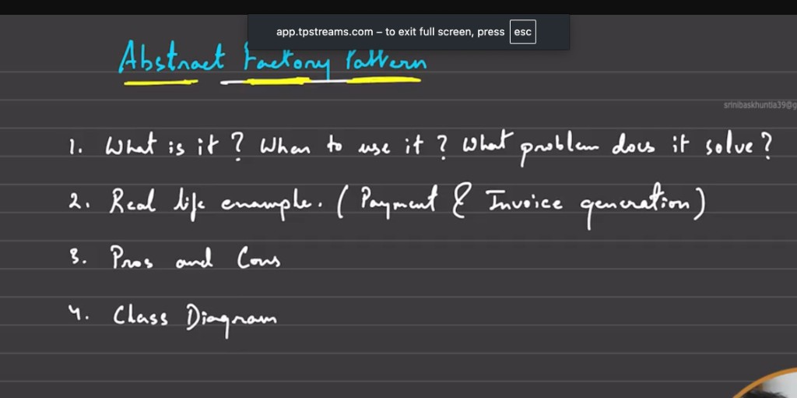
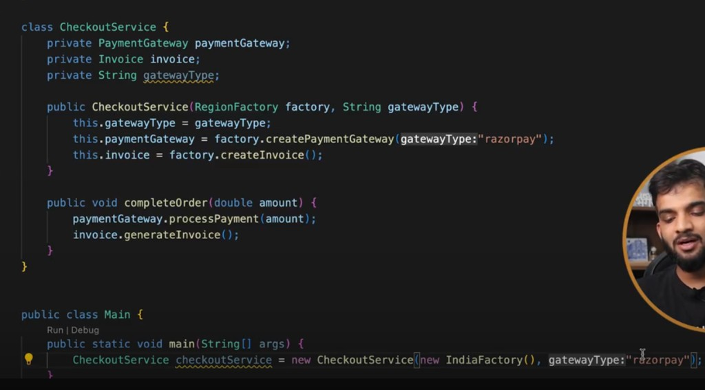
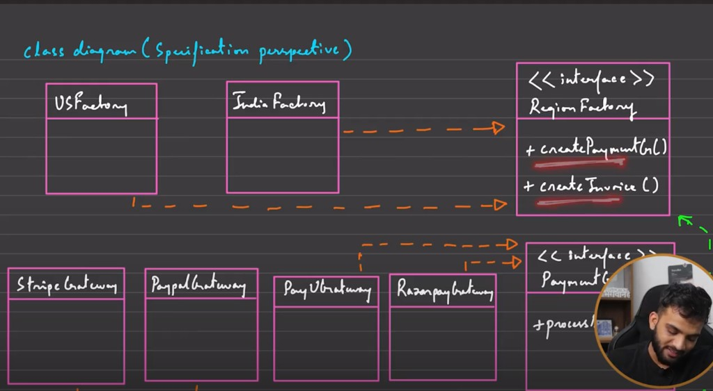
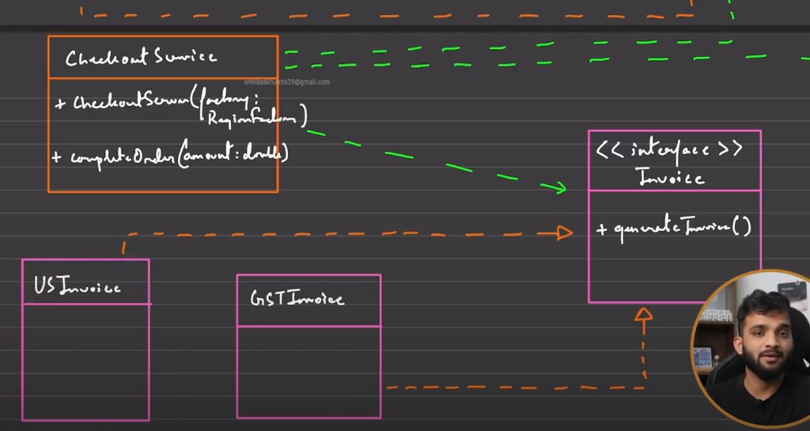

# Abstract Factory Pattern

## 1. What is it? What problem does it solve?

Abstract Factory provides an interface for creating **families of related objects** without specifying their concrete classes.

In simple terms:

- Factory creates **one** object type.
- Abstract Factory creates a **set of matching objects**.



**Problem it solves**

When client code needs multiple related objects (for example `PaymentGateway` + `Invoice`) and those objects must stay compatible by region/environment, direct `new` calls cause tight coupling and inconsistency.

---

## 2. Real-life example: Checkout by region

Assume we support regions:

- **India** -> `Razorpay/PayU` + `GSTInvoice`
- **US** -> `Stripe/Paypal` + `USInvoice`

If checkout code directly creates `new RazorpayGateway()` and `new GSTInvoice()`, adding US/Japan requires editing client code repeatedly.

With Abstract Factory, checkout asks a `RegionFactory` for both objects and remains decoupled from concrete implementations.

---

## 3. Naive approach (what to avoid)

```java
class CheckoutService {
    private final String countryCode;
    private final String gatewayType;

    CheckoutService(String countryCode, String gatewayType) {
        this.countryCode = countryCode;
        this.gatewayType = gatewayType;
    }

    void checkout(double amount) {
        PaymentGateway gateway;
        Invoice invoice;

        if (countryCode.equals("IN")) {
            gateway = gatewayType.equals("razorpay") ? new RazorpayGateway() : new PayUGateway();
            invoice = new GSTInvoice();
        } else {
            gateway = gatewayType.equals("stripe") ? new StripeGateway() : new PaypalGateway();
            invoice = new USInvoice();
        }

        gateway.processPayment(amount);
        invoice.generateInvoice();
    }
}
```

This mixes business flow + object creation + region rules in one place.

---

## 4. Abstract Factory design

### 4.1 Product interfaces

```java
interface PaymentGateway {
    void processPayment(double amount);
}

interface Invoice {
    void generateInvoice();
}
```

### 4.2 Concrete products

```java
class RazorpayGateway implements PaymentGateway {
    public void processPayment(double amount) {
        System.out.println("INR via Razorpay: " + amount);
    }
}

class PayUGateway implements PaymentGateway {
    public void processPayment(double amount) {
        System.out.println("INR via PayU: " + amount);
    }
}

class StripeGateway implements PaymentGateway {
    public void processPayment(double amount) {
        System.out.println("USD via Stripe: " + amount);
    }
}

class PaypalGateway implements PaymentGateway {
    public void processPayment(double amount) {
        System.out.println("USD via Paypal: " + amount);
    }
}

class GSTInvoice implements Invoice {
    public void generateInvoice() {
        System.out.println("Generating GST invoice (India)");
    }
}

class USInvoice implements Invoice {
    public void generateInvoice() {
        System.out.println("Generating US tax invoice");
    }
}
```

### 4.3 Abstract factory

```java
interface RegionFactory {
    PaymentGateway createPaymentGateway(String gatewayType);
    Invoice createInvoice();
}
```

### 4.4 Concrete factories

```java
class IndiaFactory implements RegionFactory {
    public PaymentGateway createPaymentGateway(String gatewayType) {
        return switch (gatewayType.toLowerCase()) {
            case "razorpay" -> new RazorpayGateway();
            case "payu" -> new PayUGateway();
            default -> throw new IllegalArgumentException("Unsupported IN gateway: " + gatewayType);
        };
    }

    public Invoice createInvoice() {
        return new GSTInvoice();
    }
}

class USFactory implements RegionFactory {
    public PaymentGateway createPaymentGateway(String gatewayType) {
        return switch (gatewayType.toLowerCase()) {
            case "stripe" -> new StripeGateway();
            case "paypal" -> new PaypalGateway();
            default -> throw new IllegalArgumentException("Unsupported US gateway: " + gatewayType);
        };
    }

    public Invoice createInvoice() {
        return new USInvoice();
    }
}
```

### 4.5 Client (checkout) uses only abstractions

```java
class CheckoutService {
    private final PaymentGateway paymentGateway;
    private final Invoice invoice;

    CheckoutService(RegionFactory factory, String gatewayType) {
        this.paymentGateway = factory.createPaymentGateway(gatewayType);
        this.invoice = factory.createInvoice();
    }

    void completeOrder(double amount) {
        paymentGateway.processPayment(amount);
        invoice.generateInvoice();
    }
}

public class Main {
    public static void main(String[] args) {
        CheckoutService indiaCheckout = new CheckoutService(new IndiaFactory(), "razorpay");
        indiaCheckout.completeOrder(999.0);

        CheckoutService usCheckout = new CheckoutService(new USFactory(), "stripe");
        usCheckout.completeOrder(29.0);
    }
}
```

---

## 5. Why this is better

- Keeps product family consistent (`IN gateway` + `IN invoice`).
- Client is decoupled from concrete classes.
- New region can be added by adding one new factory + products.
- Centralizes creation rules and improves maintainability.

---

## 6. Pros and cons



| Pros | Cons |
|------|------|
| Ensures consistency among related objects | More classes/interfaces |
| Decouples client from concrete implementations | Increased upfront design complexity |
| Good support for OCP when adding new families (regions/themes) | Overkill for simple systems |
| Centralized object creation logic | Harder to understand initially |
| Scalable for multi-region/multi-platform variants | |

---

## 7. Class diagram

### 7.1 Client interaction view



### 7.2 Specification/structure view



---

## 8. When to use vs avoid

### Use when

- You need to create multiple related objects together.
- Objects must be used as compatible families.
- You expect to add new families (new region/platform/theme).

### Avoid when

- You only need one object type (simple Factory is enough).
- Domain is small and not expected to grow.
- Added abstraction cost is not justified.

---

## 9. Quick self-check

- [ ] Why is this pattern called a factory of factories/families?
- [ ] In checkout example, what changes when we add `JapanFactory`?
- [ ] Why is `CheckoutService` easier to test in this design?
- [ ] When is simple Factory enough instead of Abstract Factory?


