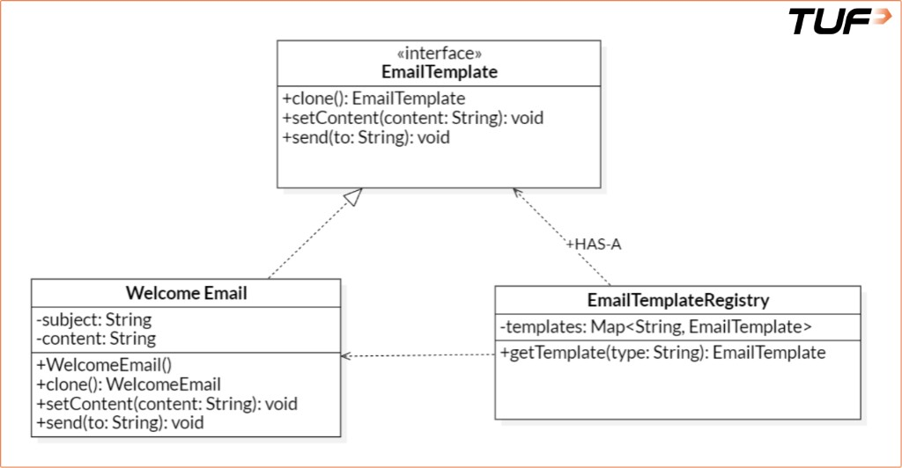

# Prototype Pattern

## 1. What is it?

The **Prototype Pattern** is a creational design pattern used to **clone existing objects** instead of constructing them from scratch. It helps when initialization is complex or costly and you need many similar instances with small variations.

**Formal definition:** The Prototype pattern creates duplicate objects while keeping performance in mind. It copies an original object into a new one **without making client code depend on their concrete classes**.

**In simpler terms:** You already have a fully configured object (like an email template or a game character). Instead of rebuilding it every time, you **copy** it and tweak what differs—same idea as duplicating a document and changing only the name.

**Analogy (photocopy machine):** You write one offer letter, photocopy it ten times, and change only the recipient on each copy. The Prototype pattern starts from a base object and produces modified copies with minimal work.

---

## 2. When it helps

A common situation is an **email notification system**: each message needs templates, configuration, user settings, and formatting. Building every email from scratch is redundant. A **pre-configured prototype** that you clone per user—then adjust a few fields—saves time and reduces mistakes.

---

## 3. Suitable use cases

- Object creation is **resource-intensive** or **complex**.
- You need **many similar objects** with **slight variations**.
- You want to **avoid repeating** initialization logic.
- You need **runtime** creation **without tight coupling** to concrete classes.

---

## 4. Naive approach (what to avoid)

Tight coupling to `WelcomeEmail`, repeated `new WelcomeEmail()`, no cloning—each variation re-runs the same setup.

```java
import java.util.*;

interface EmailTemplate {
    void setContent(String content);
    void send(String to);
}

class WelcomeEmail implements EmailTemplate {
    private String subject;
    private String content;

    public WelcomeEmail() {
        this.subject = "Welcome to TUF+";
        this.content = "Hi there! Thanks for joining us.";
    }

    @Override
    public void setContent(String content) {
        this.content = content;
    }

    @Override
    public void send(String to) {
        System.out.println("Sending to " + to + ": [" + subject + "] " + content);
    }
}

class Main {
    public static void main(String[] args) {
        WelcomeEmail email1 = new WelcomeEmail();
        email1.send("user1@example.com");

        WelcomeEmail email2 = new WelcomeEmail();
        email2.setContent("Hi there! Welcome to TUF Premium.");
        email2.send("user2@example.com");

        WelcomeEmail email3 = new WelcomeEmail();
        email3.setContent("Thanks for signing up. Let's get started!");
        email3.send("user3@example.com");
    }
}
```

**Issues**

- **Tight coupling** to `WelcomeEmail`; clients depend on concrete construction.
- **Repetitive instantiation** even when most state is identical.
- **Violates DRY**—repeated `new WelcomeEmail()` plus small tweaks.
- **No clone/reuse** of a shared template.

---

## 5. Prototype-based design

Prototype interface, `clone()` on concrete templates, and a **registry** that holds prototypes and returns **fresh clones** so the stored template is never mutated by callers.

```java
import java.util.*;

interface EmailTemplate extends Cloneable {
    EmailTemplate clone(); // Prefer deep copy when references exist
    void setContent(String content);
    void send(String to);
}

class WelcomeEmail implements EmailTemplate {
    private String subject;
    private String content;

    public WelcomeEmail() {
        this.subject = "Welcome to TUF+";
        this.content = "Hi there! Thanks for joining us.";
    }

    @Override
    public WelcomeEmail clone() {
        try {
            return (WelcomeEmail) super.clone();
        } catch (CloneNotSupportedException e) {
            throw new RuntimeException("Clone failed", e);
        }
    }

    @Override
    public void setContent(String content) {
        this.content = content;
    }

    @Override
    public void send(String to) {
        System.out.println("Sending to " + to + ": [" + subject + "] " + content);
    }
}

class EmailTemplateRegistry {
    private static final Map<String, EmailTemplate> templates = new HashMap<>();

    static {
        templates.put("welcome", new WelcomeEmail());
        // templates.put("discount", new DiscountEmail());
    }

    public static EmailTemplate getTemplate(String type) {
        return templates.get(type).clone();
    }
}

class Main {
    public static void main(String[] args) {
        EmailTemplate welcomeEmail1 = EmailTemplateRegistry.getTemplate("welcome");
        welcomeEmail1.setContent("Hi Alice, welcome to TUF Premium!");
        welcomeEmail1.send("alice@example.com");

        EmailTemplate welcomeEmail2 = EmailTemplateRegistry.getTemplate("welcome");
        welcomeEmail2.setContent("Hi Bob, thanks for joining!");
        welcomeEmail2.send("bob@example.com");
    }
}
```

**Why this is better**

- **`clone()`** copies instead of rebuilding from constructors each time.
- **Registry** centralizes prototype instances (`EmailTemplateRegistry`).
- **Decouples** use from how `WelcomeEmail` is constructed.
- **Performance**: reuse expensive initialization via a stored prototype.

---

## 6. Shallow cloning vs deep cloning

In Java, **`Object.clone()`** default behavior is **shallow**: primitive fields and references are copied, but **referenced objects are shared** between original and clone unless you copy them explicitly.

For the Prototype pattern, **deep cloning** is often preferred when the object graph is non-trivial: copy the object **and** the objects it references so clones do not accidentally share mutable nested state. Deep cloning avoids subtle bugs; it costs more to implement (and watch for **circular references**).

---

## 7. Pros and cons

**Pros**

- **Faster creation** when setup is heavy.
- **Fewer subclasses** for small variations.
- **Runtime configuration** of clones.
- Fits **UI/component trees** and duplicated structures.

**Cons**

- **Deep clones** can be non-trivial to implement correctly.
- **Circular references** complicate cloning.
- **Bugs** if copying semantics are wrong (shared mutable state).

---

## 8. Class diagram (structure)

The registry holds prototype instances keyed by type; `getTemplate` returns a **clone** so callers customize and send without mutating the shared prototype.


