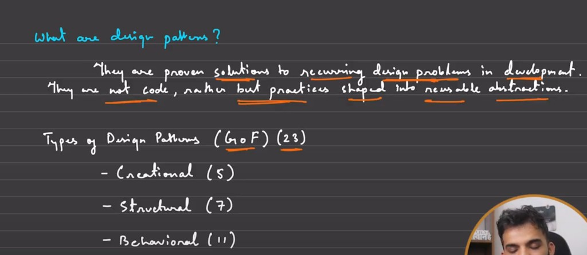
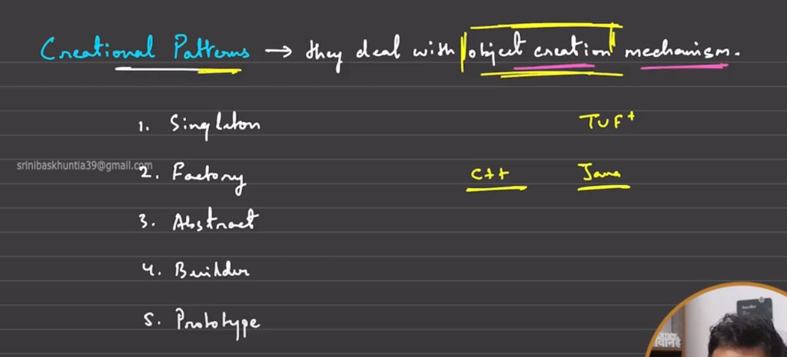
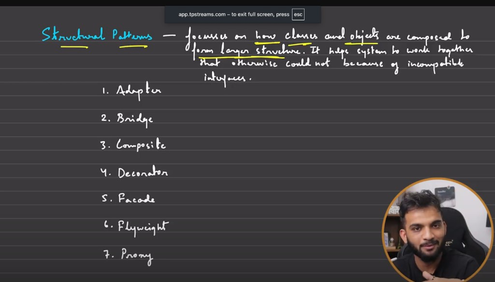
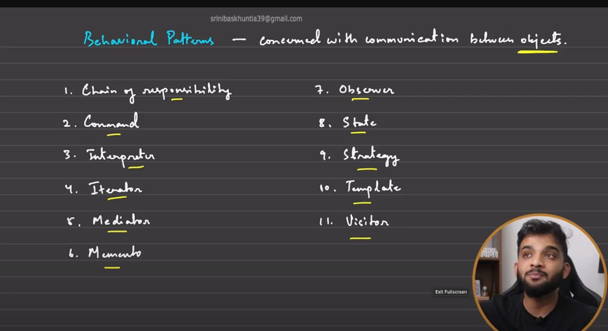

# Design Patterns

## What are design patterns?

Design patterns are proven answers to recurring design problems. They are not finished code; they are reusable abstractions and best practices.

## Creational patterns

They deal with **object creation** mechanisms.

## Structural patterns

They focus on how **classes and objects are composed** into larger structures and on making components work together despite **incompatible interfaces**.

## Behavioral patterns

They are concerned with **communication between objects**.

