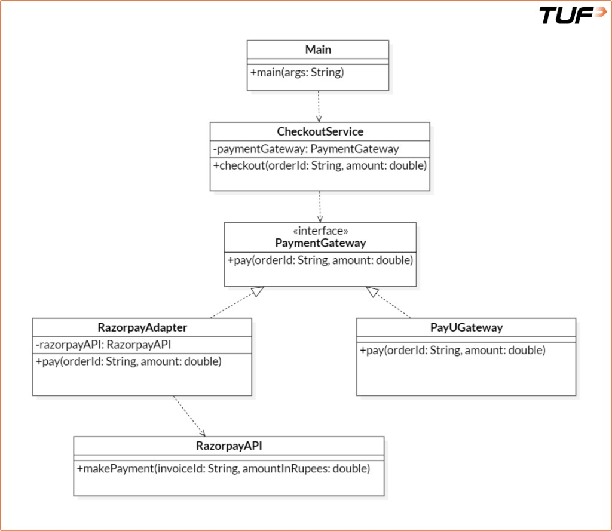
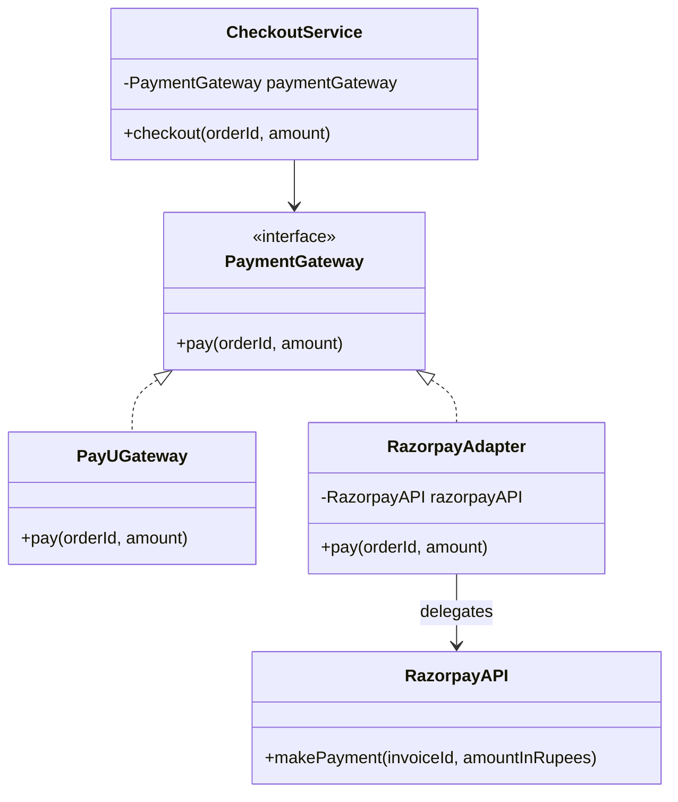

# Adapter Pattern

## 1. Introduction

Structural design patterns are concerned with the **composition of classes and objects**. They focus on how to assemble classes and objects into larger structures while keeping these structures flexible and efficient. The Adapter pattern is one of the most important structural patterns.

---

## 2. What is the Adapter Pattern?

The Adapter pattern lets **incompatible interfaces work together** by acting as a **translator** or **wrapper** around an existing class. It converts the interface of a class into another interface that a client expects.

It bridges the **Target** interface (what the client expects) and the **Adaptee** (an existing class with a different interface). This structural wrapping enables integration across diverse systems without forcing every legacy class to match your domain API overnight.

### Real-life analogy

Imagine traveling from India to Europe. Your mobile charger does not fit European sockets. Instead of buying a new charger, you use a **plug adapter**. The adapter lets your charger (Indian plug) work with the European socket, without modifying either the socket or the charger.

### Problems it addresses

- **Interface incompatibility** between classes that should collaborate.
- **Reuse** of existing classes without changing their source code.
- **Interoperation** between systems that use different method names or signatures for the same idea.

---

## 3. Real-life coding example: payment gateways

Consider a **payment gateway** setup with two providers: **PayU** and **Razorpay**. PayU already implements your standard `PaymentGateway` interface. Razorpay exposes a different API (`makePayment` instead of `pay`), so it does not implement `PaymentGateway` as-is.

### 3.1 Without an adapter (incompatible interface)

```java
// Target: standard interface expected by CheckoutService
interface PaymentGateway {
    void pay(String orderId, double amount);
}

// Concrete PaymentGateway for PayU
class PayUGateway implements PaymentGateway {
    @Override
    public void pay(String orderId, double amount) {
        System.out.println("Paid Rs. " + amount + " using PayU for order: " + orderId);
    }
}

// Adaptee: existing class with a different interface
class RazorpayAPI {
    public void makePayment(String invoiceId, double amountInRupees) {
        System.out.println("Paid Rs. " + amountInRupees + " using Razorpay for invoice: " + invoiceId);
    }
}

// Client: depends on PaymentGateway
class CheckoutService {
    private final PaymentGateway paymentGateway;

    public CheckoutService(PaymentGateway paymentGateway) {
        this.paymentGateway = paymentGateway;
    }

    public void checkout(String orderId, double amount) {
        paymentGateway.pay(orderId, amount);
    }
}

class Main {
    public static void main(String[] args) {
        CheckoutService checkoutService = new CheckoutService(new PayUGateway());
        checkoutService.checkout("12", 1780);
    }
}
```

### 3.2 What goes wrong

- **CheckoutService** expects any provider to implement **PaymentGateway**.
- **PayUGateway** satisfies that and works.
- **RazorpayAPI** uses **makePayment** and does **not** implement **PaymentGateway**, so it cannot be passed to **CheckoutService** without changes.

That is **interface incompatibility**: same responsibility (charge money), different shape. The Adapter pattern fixes this by wrapping **RazorpayAPI** so it **looks like** a **PaymentGateway**, without editing **RazorpayAPI** or **CheckoutService**.

### 3.3 With the Adapter pattern

```java
interface PaymentGateway {
    void pay(String orderId, double amount);
}

class PayUGateway implements PaymentGateway {
    @Override
    public void pay(String orderId, double amount) {
        System.out.println("Paid Rs. " + amount + " using PayU for order: " + orderId);
    }
}

class RazorpayAPI {
    public void makePayment(String invoiceId, double amountInRupees) {
        System.out.println("Paid Rs. " + amountInRupees + " using Razorpay for invoice: " + invoiceId);
    }
}

// Adapter: RazorpayAPI used where PaymentGateway is expected
class RazorpayAdapter implements PaymentGateway {
    private final RazorpayAPI razorpayAPI;

    public RazorpayAdapter() {
        this.razorpayAPI = new RazorpayAPI();
    }

    @Override
    public void pay(String orderId, double amount) {
        razorpayAPI.makePayment(orderId, amount);
    }
}

class CheckoutService {
    private final PaymentGateway paymentGateway;

    public CheckoutService(PaymentGateway paymentGateway) {
        this.paymentGateway = paymentGateway;
    }

    public void checkout(String orderId, double amount) {
        paymentGateway.pay(orderId, amount);
    }
}

class Main {
    public static void main(String[] args) {
        CheckoutService checkoutService = new CheckoutService(new RazorpayAdapter());
        checkoutService.checkout("12", 1780);
    }
}
```

**RazorpayAdapter** implements **PaymentGateway**, holds a **RazorpayAPI**, and translates **pay(orderId, amount)** into **makePayment(invoiceId, amountInRupees)**. The client keeps depending only on **PaymentGateway**; Razorpay stays a third-party-shaped API behind the adapter.

---

## 4. When to use the Adapter pattern

- You must use an existing class, but its interface does not match what your system expects.
- You want to **reuse legacy or vendor code** without rewriting it.
- You are integrating **third-party APIs** or external services behind a stable internal interface.

---

## 5. Advantages and disadvantages

**Pros**

- **Reuse** existing implementations without changing them.
- **Extensibility**: swap or add providers behind the same target interface.
- **Minimal churn** in client code that already depends on the target abstraction.
- **Simpler third-party integration** behind one façade.

**Cons**

- **Extra layer** of indirection; can add noise if overused.
- **Design clarity** can suffer if adapters proliferate without clear boundaries.

---

## 6. Real product use cases

### Payment gateways

Different providers (PayPal, Stripe, Razorpay, PayU) use different method names, parameters, and payloads. A common **PaymentGateway** (or checkout port) plus **per-provider adapters** lets checkout logic stay stable while you add or switch providers.

### Logging frameworks

Apps may need Log4j, SLF4J, JUL, etc. An adapter can expose one **app-level logging API** and delegate to the chosen library, so call sites stay unchanged when the backend changes.

### Cloud SDKs

AWS, Azure, and GCP offer similar capabilities with different SDKs. A **storage** or **compute** port in your code, with cloud-specific adapters, supports multi-cloud or migration without rewriting domain logic.

---

## 7. Class diagram

**Roles:** **PaymentGateway** is the target interface; **RazorpayAPI** is the adaptee; **RazorpayAdapter** implements the target and delegates to the adaptee; **CheckoutService** depends only on the target.



**Relationships:** **Main** uses **CheckoutService**. **CheckoutService** depends on **PaymentGateway** (not concrete gateways). **PayUGateway** and **RazorpayAdapter** implement **PaymentGateway**. **RazorpayAdapter** holds **RazorpayAPI** and translates `pay(orderId, amount)` to `makePayment(invoiceId, amountInRupees)`.

<details>
<summary>Mermaid equivalent (optional)</summary>



</details>

---

## 8. Quick self-check

- [ ] What are **Target**, **Adaptee**, and **Adapter** in your own words?
- [ ] Why can **CheckoutService** not use **RazorpayAPI** directly in the first example?
- [ ] How does the adapter avoid changing **RazorpayAPI** or **CheckoutService**?
- [ ] When is an adapter preferable to editing the vendor class?

---

## 9. Assignment: media player adapter

Your **universal media player** client only talks to this target API:

```java
void play(String audioType, String fileName);
```

Third-party libraries speak different APIs:

- **VlcPlayer**: `playVlc(String file)`
- **Mp4Player** (legacy): `playMp4Video(String path)`

### Problem

Implement **MediaAdapter** so that **AudioPlayer** can route `vlc` and `mp4` through adapters to the right third-party player **without** changing **VlcPlayer** or **Mp4Player**.

### Starter code (fill the TODOs)

```java
interface AdvancedMediaPlayer {
    void playVlc(String fileName);
    void playMp4(String fileName);
}

// Third-party / legacy — do not modify
class VlcPlayer implements AdvancedMediaPlayer {
    @Override
    public void playVlc(String fileName) {
        System.out.println("Playing vlc file: " + fileName);
    }

    @Override
    public void playMp4(String fileName) {
        // not used for vlc-only player
    }
}

class Mp4Player implements AdvancedMediaPlayer {
    @Override
    public void playVlc(String fileName) { }

    @Override
    public void playMp4(String fileName) {
        System.out.println("Playing mp4 file: " + fileName);
    }
}

// Target interface expected by the client
interface MediaPlayer {
    void play(String audioType, String fileName);
}

// TODO: implement — adapts AdvancedMediaPlayer to MediaPlayer for vlc/mp4
class MediaAdapter implements MediaPlayer {
    // private fields, constructor, play() that dispatches by audioType
}

class AudioPlayer implements MediaPlayer {
    // TODO: for "mp3" handle locally; for "vlc"/"mp4" delegate to MediaAdapter
    @Override
    public void play(String audioType, String fileName) {
        // ...
    }
}

public class Main {
    public static void main(String[] args) {
        AudioPlayer player = new AudioPlayer();
        player.play("mp3", "song.mp3");
        player.play("vlc", "movie.vlc");
        player.play("mp4", "clip.mp4");
    }
}
```

### Expected output

```text
Playing mp3 file: song.mp3
Playing vlc file: movie.vlc
Playing mp4 file: clip.mp4
```

(You may print a slightly different line for mp3 as long as it is clearly "mp3" handling and the vlc/mp4 lines match the third-party behavior above.)

### Constraints

- Do not change **VlcPlayer** or **Mp4Player** bodies except wiring from your adapter.
- **AudioPlayer** must not call `playVlc` / `playMp4` directly for the demo flow; routing for vlc/mp4 goes through **MediaAdapter**.

<details>
<summary>Show solution sketch</summary>

```java
class MediaAdapter implements MediaPlayer {
    private final AdvancedMediaPlayer advanced;

    public MediaAdapter(String audioType) {
        if ("vlc".equalsIgnoreCase(audioType)) {
            advanced = new VlcPlayer();
        } else if ("mp4".equalsIgnoreCase(audioType)) {
            advanced = new Mp4Player();
        } else {
            throw new IllegalArgumentException("Unsupported type for adapter: " + audioType);
        }
    }

    @Override
    public void play(String audioType, String fileName) {
        if ("vlc".equalsIgnoreCase(audioType)) {
            advanced.playVlc(fileName);
        } else if ("mp4".equalsIgnoreCase(audioType)) {
            advanced.playMp4(fileName);
        }
    }
}

class AudioPlayer implements MediaPlayer {
    @Override
    public void play(String audioType, String fileName) {
        if ("mp3".equalsIgnoreCase(audioType)) {
            System.out.println("Playing mp3 file: " + fileName);
        } else if ("vlc".equalsIgnoreCase(audioType) || "mp4".equalsIgnoreCase(audioType)) {
            MediaPlayer adapter = new MediaAdapter(audioType);
            adapter.play(audioType, fileName);
        } else {
            throw new IllegalArgumentException("Unsupported media: " + audioType);
        }
    }
}
```

</details>
