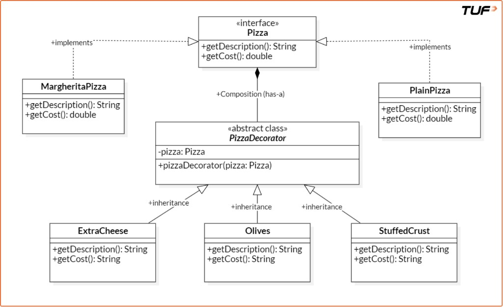
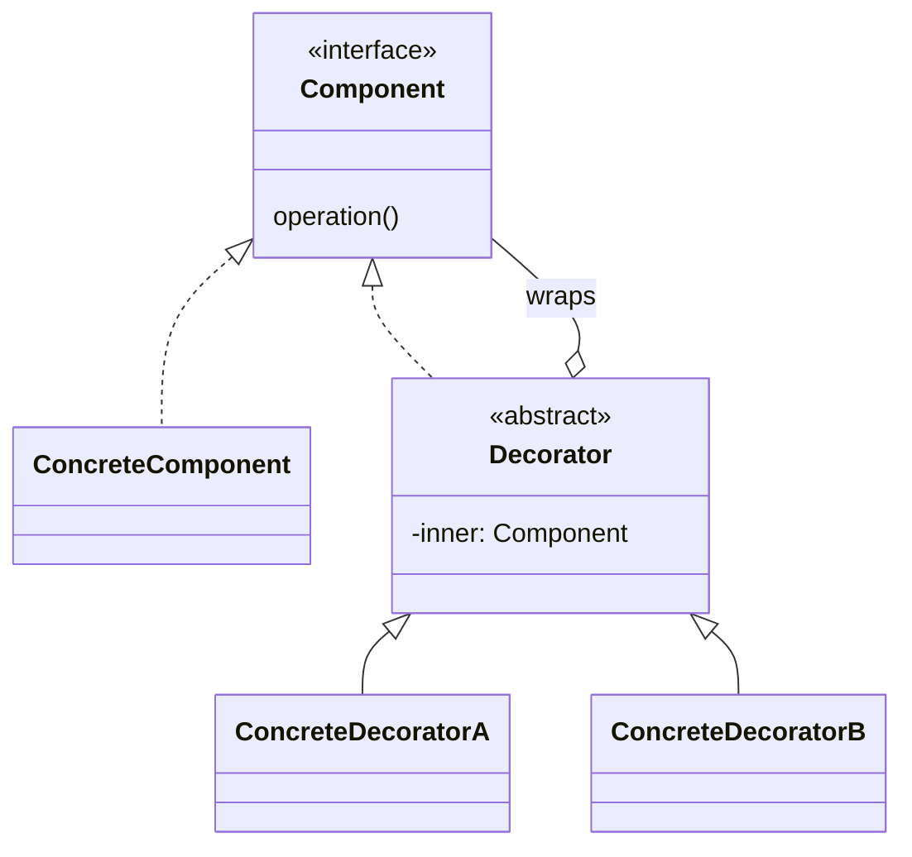

# Decorator Pattern

## What it is (one sentence)

The Decorator Pattern is a structural design pattern that allows behavior to be added to individual objects, dynamically at runtime, without affecting the behavior of other objects from the same class.

## Everyday picture

You order a coffee. Then you add milk, then sugar. You did not invent a new drink name for “coffee + milk + sugar.” You **stack** extras on one base drink. Decorator is the same idea in code.

## Why not use only inheritance?

If every mix of toppings were its own class, you get **too many classes** and they repeat logic:

```java
class PlainPizza {}
class CheesePizza extends PlainPizza {}
class OlivePizza extends PlainPizza {}
// cheese + olive + stuffed crust? another class…
// every combo → another class → hard to maintain
```

## What we do instead

1. A **small interface** for the thing (e.g. pizza: name + price).  
2. A few **base** types (plain pizza, margherita).  
3. For each extra (cheese, olives, …), a **wrapper class** that:
   - holds the pizza **inside** it,
   - when asked for name/price, **asks the inner pizza first**, then **adds** its own part.

So you **compose** behavior by nesting wrappers instead of making subclasses for every mix.

```java
interface Pizza {
    String getDescription();
    double getCost();
}

class MargheritaPizza implements Pizza {
    public String getDescription() { return "Margherita Pizza"; }
    public double getCost() { return 200.0; }
}

// Base for all toppings: stores the pizza underneath
abstract class PizzaDecorator implements Pizza {
    protected Pizza pizza;
    public PizzaDecorator(Pizza pizza) { this.pizza = pizza; }
}

class ExtraCheese extends PizzaDecorator {
    public ExtraCheese(Pizza pizza) { super(pizza); }
    public String getDescription() { return pizza.getDescription() + ", Extra Cheese"; }
    public double getCost() { return pizza.getCost() + 40.0; }
}

class Olives extends PizzaDecorator {
    public Olives(Pizza pizza) { super(pizza); }
    public String getDescription() { return pizza.getDescription() + ", Olives"; }
    public double getCost() { return pizza.getCost() + 30.0; }
}

class StuffedCrust extends PizzaDecorator {
    public StuffedCrust(Pizza pizza) { super(pizza); }
    public String getDescription() { return pizza.getDescription() + ", Stuffed Crust"; }
    public double getCost() { return pizza.getCost() + 50.0; }
}

// Read inside → out: margherita, then cheese, olives, stuffed crust on the outside
Pizza order = new StuffedCrust(new Olives(new ExtraCheese(new MargheritaPizza())));
```

Think of it like **onion layers**: when you call `getDescription()` on `order`, the **outer** layer runs first and asks the next layer until it reaches the real margherita in the middle.

## Good points

- New topping = **one new small class**, not dozens of combo classes.  
- Same topping class works on **any** pizza.  
- You can change **how** you stack at runtime (different orders).

## Downsides

- You end up with **many small classes**.  
- Deep nesting can make **debugging** (reading stack traces) a bit harder until you are used to it.

## When it fits

Whenever users pick **optional extras** that combine in many ways: food add-ons, text formatting (bold + italic + …), HTTP middleware-style layers, etc.

## Picture of the roles

Pizza example (interface, base pizzas, `PizzaDecorator` wrapping `Pizza`, concrete toppings):



Generic shape (same idea with abstract names):



- **Component:** the shared interface (what `getDescription` / `getCost` looks like).  
- **Concrete component:** the real base object (e.g. margherita).  
- **Decorator:** holds **that** object inside and adds something on top.

## Assignment

Build **your own** small example (do not copy the pizza code above).

1. **Choose:**  
   - **Coffee:** base drinks + milk / sugar / whipped cream (name + price), or  
   - **Text:** plain string + decorators that change the text (uppercase, prefix, brackets).

2. **Must have:** two base types, three add-on wrappers, one `main` that prints **two different** orders (two different stacks).

3. **Optional:** stop “extra shot” from being added twice; write one line on whether **order of wrapping** changes the result.

Use Java (or whatever your practice folder uses).
