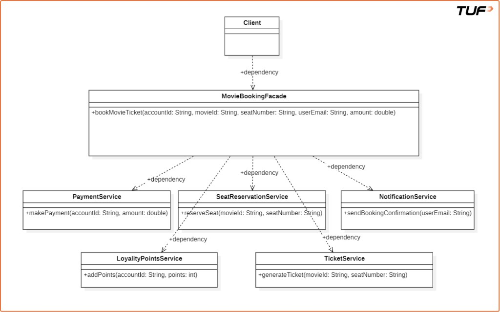
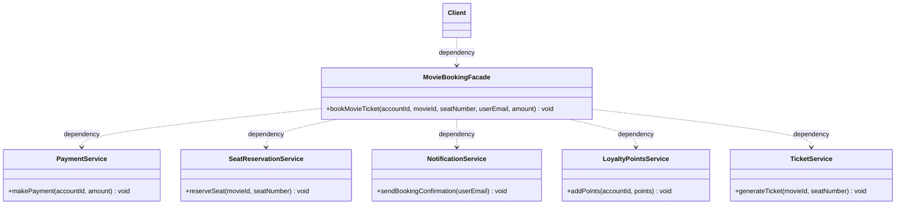

# Facade Pattern

## Introduction

Structural design patterns are concerned with the composition of classes and objects. They help in forming large object structures while keeping them manageable, decoupled, and easy to work with. One such pattern is the Facade Pattern, which simplifies complex systems by providing a unified interface.

## What it is

The Facade Pattern is a structural design pattern that provides a simplified, unified interface to a complex subsystem or group of classes.

It acts as a single entry point for clients to interact with the system, hiding the underlying complexity and making the system easier to use.

## Real-life analogy

Think of **manual vs. automatic car**:

- **Complex subsystem (manual car):** Driving a manual car requires intricate knowledge of multiple components (clutch, gear shifter, accelerator) and their precise coordination to shift gears and drive. It is complex and requires the driver to manage many interactions.
- **Facade (automatic car):** An automatic car acts as a facade. It provides a simplified interface (for example, “Drive,” “Reverse,” “Park”) to the complex underlying mechanics of gear shifting. The driver (client) no longer needs to manually coordinate the clutch and gears; the automatic transmission handles these complexities internally, making driving much easier.

In short, the manual car exposes the complexity, while the automatic car (the facade) simplifies it for the user.

## Problem it solves

It solves the problem of dealing with complex subsystems by hiding the complexities behind a single, unified interface. For example, imagine a movie ticket booking system with:

- `PaymentService`
- `SeatReservationService`
- `NotificationService`
- `LoyaltyPointsService`
- `TicketService`

Instead of making the client interact with all of these directly, the Facade Pattern provides a single class like `MovieBookingFacade`, which internally coordinates all the services.

## Real-life coding example

Imagine you are developing a movie ticket booking application, like BookMyShow. First, consider a poorly structured approach to implementing the booking functionality.

### The bad way (without the Facade pattern)

```java
// Service class responsible for handling payments
class PaymentService {
    public void makePayment(String accountId, double amount) {
        System.out.println("Payment of ₹" + amount + " successful for account " + accountId);
    }
}

// Service class responsible for reserving seats
class SeatReservationService {
    public void reserveSeat(String movieId, String seatNumber) {
        System.out.println("Seat " + seatNumber + " reserved for movie " + movieId);
    }
}

// Service class responsible for sending notifications
class NotificationService {
    public void sendBookingConfirmation(String userEmail) {
        System.out.println("Booking confirmation sent to " + userEmail);
    }
}

// Service class for managing loyalty/reward points
class LoyaltyPointsService {
    public void addPoints(String accountId, int points) {
        System.out.println(points + " loyalty points added to account " + accountId);
    }
}

// Service class for generating movie tickets
class TicketService {
    public void generateTicket(String movieId, String seatNumber) {
        System.out.println("Ticket generated for movie " + movieId + ", Seat: " + seatNumber);
    }
}

// Client Code
class Main {
    public static void main(String[] args) {
        // Booking a movie ticket manually (without a facade)

        // Step 1: Make payment
        PaymentService paymentService = new PaymentService();
        paymentService.makePayment("user123", 500);

        // Step 2: Reserve seat
        SeatReservationService seatReservationService = new SeatReservationService();
        seatReservationService.reserveSeat("movie456", "A10");

        // Step 3: Send booking confirmation via email
        NotificationService notificationService = new NotificationService();
        notificationService.sendBookingConfirmation("user@example.com");

        // Step 4: Add loyalty points to user's account
        LoyaltyPointsService loyaltyPointsService = new LoyaltyPointsService();
        loyaltyPointsService.addPoints("user123", 50);

        // Step 5: Generate the ticket
        TicketService ticketService = new TicketService();
        ticketService.generateTicket("movie456", "A10");
    }
}
```

While this code works, it is tightly coupled. The `Main` class (or client code) is manually calling each subsystem service in the correct order and with the correct parameters.

This leads to:

- High complexity for the client
- Duplicate code if you have to do this in multiple places
- Violation of the Single Responsibility Principle (the `Main` class knows too much)

This sets the stage for the Facade Pattern, which encapsulates all these steps in one high-level method like `bookTicket()` and makes the client code clean and readable.

### Using the Facade pattern

```java
// Service class responsible for handling payments
class PaymentService {
    public void makePayment(String accountId, double amount) {
        System.out.println("Payment of ₹" + amount + " successful for account " + accountId);
    }
}

// Service class responsible for reserving seats
class SeatReservationService {
    public void reserveSeat(String movieId, String seatNumber) {
        System.out.println("Seat " + seatNumber + " reserved for movie " + movieId);
    }
}

// Service class responsible for sending notifications
class NotificationService {
    public void sendBookingConfirmation(String userEmail) {
        System.out.println("Booking confirmation sent to " + userEmail);
    }
}

// Service class for managing loyalty/reward points
class LoyaltyPointsService {
    public void addPoints(String accountId, int points) {
        System.out.println(points + " loyalty points added to account " + accountId);
    }
}

// Service class for generating movie tickets
class TicketService {
    public void generateTicket(String movieId, String seatNumber) {
        System.out.println("Ticket generated for movie " + movieId + ", Seat: " + seatNumber);
    }
}

// ========== The MovieBookingFacade class  ==============
class MovieBookingFacade {
    private PaymentService paymentService;
    private SeatReservationService seatReservationService;
    private NotificationService notificationService;
    private LoyaltyPointsService loyaltyPointsService;
    private TicketService ticketService;

    // Constructor to initialize all the subsystem services.
    public MovieBookingFacade() {
        this.paymentService = new PaymentService();
        this.seatReservationService = new SeatReservationService();
        this.notificationService = new NotificationService();
        this.loyaltyPointsService = new LoyaltyPointsService();
        this.ticketService = new TicketService();
    }

    // Method providing a simplified interface for booking a movie ticket
    public void bookMovieTicket(String accountId, String movieId, String seatNumber, String userEmail, double amount) {
        paymentService.makePayment(accountId, amount);
        seatReservationService.reserveSeat(movieId, seatNumber);
        ticketService.generateTicket(movieId, seatNumber);
        loyaltyPointsService.addPoints(accountId, 50);
        notificationService.sendBookingConfirmation(userEmail);

        // Indicate successful completion of the entire booking process.
        System.out.println("Movie ticket booking completed successfully!");
    }
}

// Client Code
class Main {
    public static void main(String[] args) {
        // Booking a movie ticket using the facade
        MovieBookingFacade movieBookingFacade = new MovieBookingFacade();
        movieBookingFacade.bookMovieTicket("user123", "movie456", "A10", "user@example.com", 500);
    }
}
```

## How the Facade pattern solves the issue

By introducing `MovieBookingFacade`, we:

- Provide a simple, unified interface (`bookMovieTicket()`).
- Hide the complexity of internal service calls from the client.
- Reduce coupling, so changes in internal services do not affect the client as much.
- Centralize the workflow logic, making it easier to update and reuse.

## When to use the Facade pattern

You should use the Facade pattern when:

- **Subsystems are complex:** There are too many classes and too many dependencies within the system you are trying to simplify.
- **You want a simpler API for the outside world:** The facade acts as a simplified entry point, hiding complexity from clients.
- **You want to reduce coupling between subsystems and client code:** By interacting with the facade, the client becomes less dependent on individual subsystem components.
- **You want to layer your architecture cleanly:** The facade helps organize the system into distinct layers, making it more modular and understandable.

## Advantages

- **Lightweight coupling:** It reduces dependencies between the client and the subsystem.
- **Flexibility:** The subsystem can evolve without impacting the client code as strongly.
- **Simplifies client design:** Clients interact with a single, simplified interface instead of many complex objects.
- **Promotes layered architecture:** It helps organize the system into distinct layers, improving maintainability and scalability.
- **Better testability:** Subsystem components can be tested independently, and the facade can be tested for orchestration logic.

## Disadvantages

- **Fragile coupling:** If the facade changes frequently, it can still cause ripple effects on client code.
- **Hidden complexity:** The underlying complexity still exists; debugging or understanding the full flow can be harder for people working on the subsystem.
- **Runtime errors:** Errors from the subsystem may be harder to diagnose when you only interact through the facade.
- **Difficult to trace:** The facade adds indirection, which can make debugging harder.
- **Violation of SRP:** A facade that orchestrates a very large, diverse set of operations can become a “god object.”

## Class diagram

UML view: the client depends only on the facade; the facade depends on each subsystem service.



The same structure in Mermaid (handy when images are not rendered):



## Practice question

You are building a small **home theater** setup. The subsystem already has separate classes:

- `Amplifier` — power on/off, set volume
- `DvdPlayer` — on/off, play a title
- `Projector` — on/off, set wide-screen mode
- `TheaterLights` — dim to a given level

**Task:** Introduce a **facade** class (for example `HomeTheaterFacade`) with a single method such as `watchMovie(String title)` that performs the right sequence (lights dim, projector on, amp on, DVD play, and so on) and a method such as `endMovie()` that shuts things down in a sensible order.

**Rules:**

- Client code should call only the facade for the “watch movie” and “end movie” flows, not each device directly.
- Subsystem classes stay as they are; the facade only orchestrates them.

Put your solution under `Practice/Facade/` (or your usual practice folder) in Java or another language you use for this repo.
