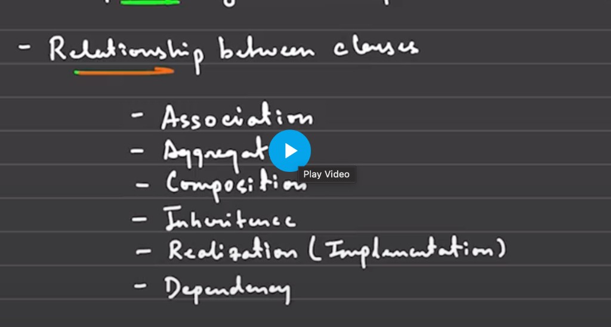
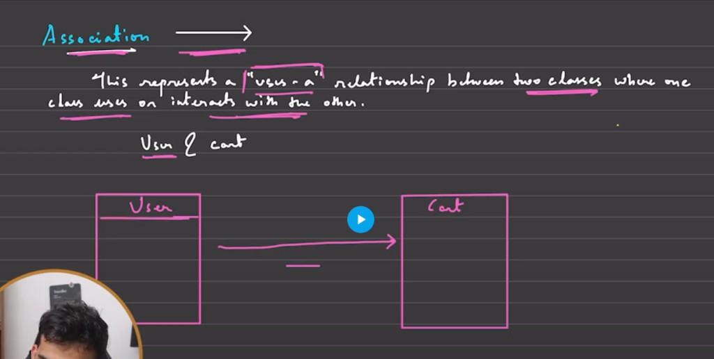
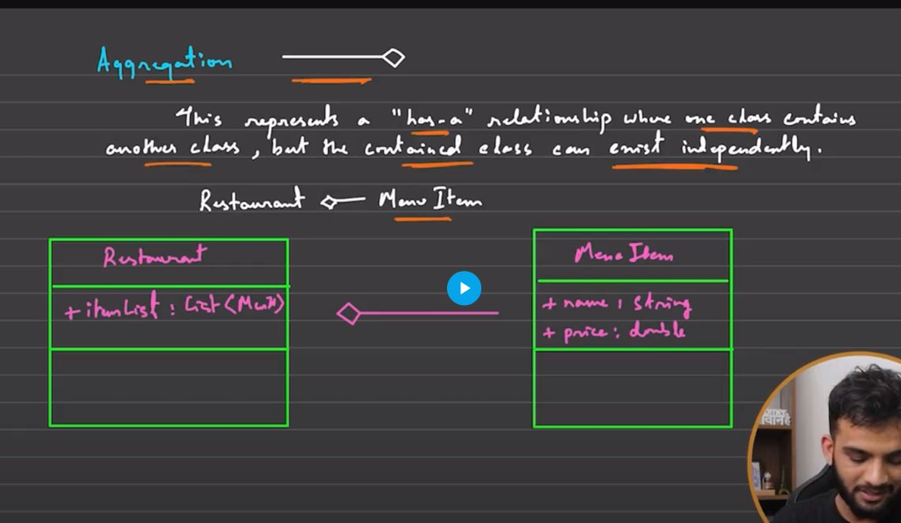
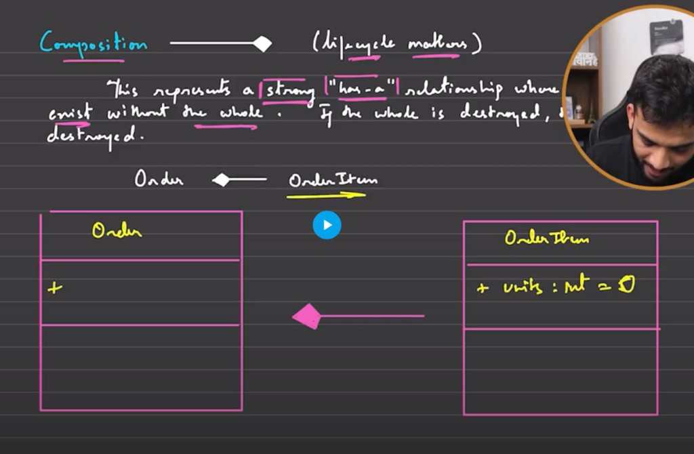
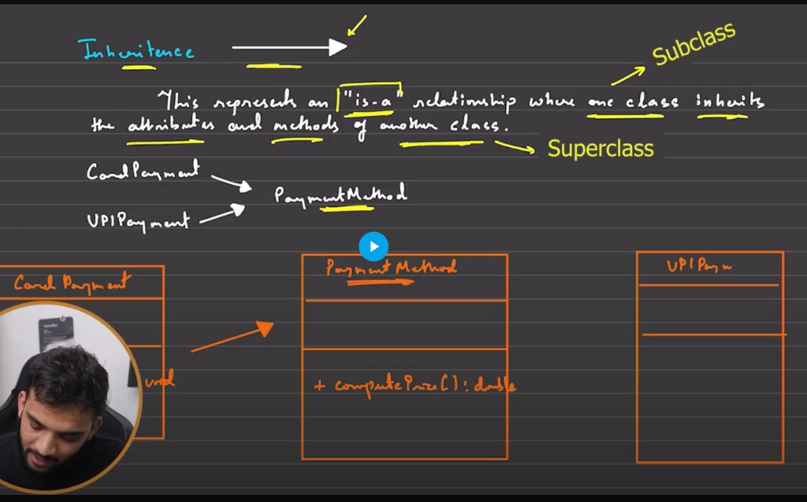
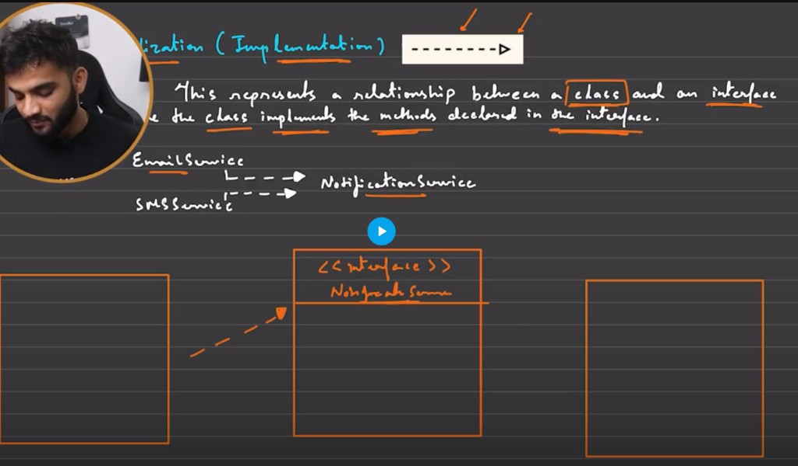
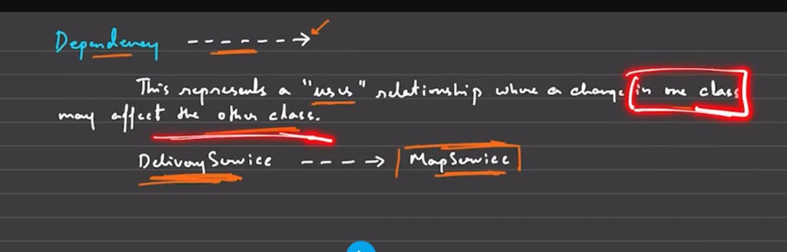

# Relationships in UML

## Overview — relationships between classes

## Association

## Aggregation

## Composition

## Inheritance (generalization)

## Realization (implementation)

## Dependency

