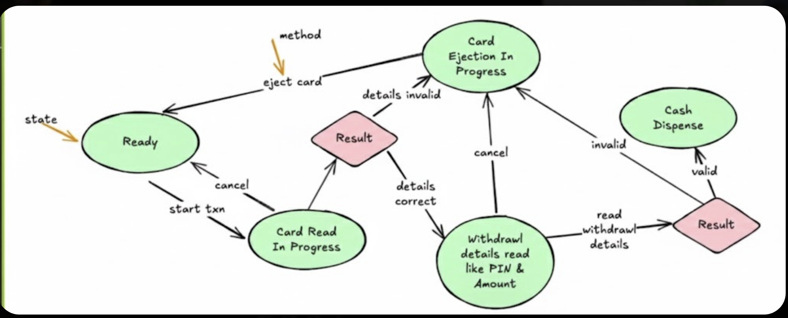

-  entities and models 
- no DB is involved
- console app is fine

## Feature requirements 
- Single payment Transaction support (Only one person can withdraw at a time)
- StartButton to start the transaction (No concurrency is involved)
- validation of card upon insertion , also pin is validated
- insert amount , amount should be less than or equal to balance and then withdrawl is done

## Flow of user journey
- start button -->    API call is made  --> user cancels or proceeds to withdrawl
- Card Details and pin send for validation --> API call is made --> if valid then proceed to withdrawl else user cancels
- Cash Dispenser is used to dispense the cash --> API call is made --> if cash is dispensed then transaction is successful else user cancels(in the middle of the transaction user cannot cancel)
- Transaction is successful --> API call is made --> transaction is successful else user cancels
- close button --> API call is made --> transaction is cancelled

## API Endpoints
- /start-transaction
- /validate-card
- /withdrawl
- /close-transaction
- /cancel-transaction

## Basic API Design 
- ATM class 
    startTransaction() --> returns a transaction id
    closeTransaction(transactionId) --> returns a boolean
    cancelTransaction(transactionId) --> returns a boolean
    validateCard(cardNumber, pin) --> returns a boolean
    withdrawl(transactionId, amount) --> returns a boolean
    readCard() --> returns a card number
    dispenseCash(transactionId, amount) --> returns a boolean

## The above API design have flaws
- multiple ATM machines are not supported
- no unique id for ATM machine
- presses startButton 5 times , then 5 transactions are started
- Every step takes some time , no state management(no mechanism to know which step is in progress) is done
- Violates single responsibility principle , ATM class is responsible for starting a transaction , validating a card , dispensing cash , closing a transaction , cancelling a transaction , but it is also responsible for reading a card , dispensing cash , closing a transaction , cancelling a transaction

## ATM states 

- At each state , we can do use some functionality but not all
- storing state as enum is not a good idea  because each state can have multiple sub states.
- 